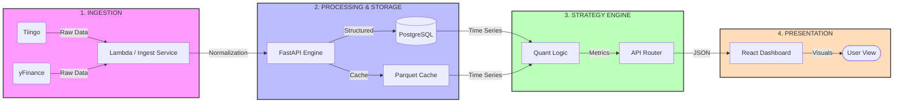
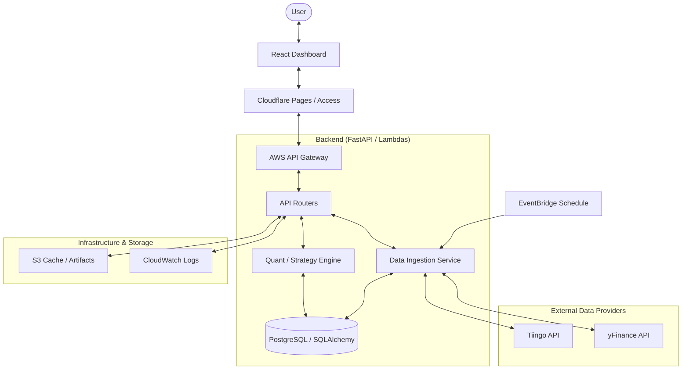
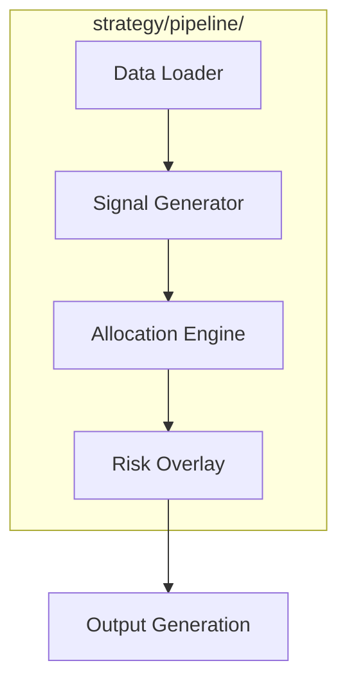

# 🗺️ Functional Data Flow & Architecture Map

This document outlines the end-to-end journey of data within the `potential-parakeet` ecosystem.

> [!NOTE]
> **Mermaid Support**: If diagrams appear as code, ensure your Markdown viewer (VS Code, GitHub, etc.) has Mermaid rendering enabled.

---

## 📂 Project Structure

A detailed view of the reorganized codebase and component responsibilities:

```text
potential-parakeet/
├── strategy/                   # 🧠 Core Quant Logic & Calculations
│   ├── quant2/                 # Advanced Quant 2.0 (OLMAR, StatArb, Meta-Labeling)
│   ├── pipeline/               # Modular Pipeline (Data, Signal, Allocation layers)
│   ├── olps/                   # Online Portfolio Selection Models
│   ├── stock_universe.py       # Universe definitions (SPX, ASX, NASDAQ)
│   └── fast_data_loader.py     # Incremental data fetching engine
│
├── dashboard/                  # 📊 Frontend Web Application (React/Vite)
│   ├── src/components/         # UI Components (Charts, Alpha Matrix, Layout)
│   ├── src/hooks/              # Custom Hooks (useMetrics, useTrades)
│   └── src/services/           # API Client & Data Transformation
│
├── backend/                    # ⚙️ FastAPI REST API
│   ├── routers/                # API Endpoints (trades, data, strategies, scanner)
│   ├── database/               # SQLAlchemy Models & Bi-temporal Schema
│   ├── services/               # Business logic & external API wrappers
│   └── main.py                 # API Entry point
│
├── scripts/                    # 🛠️ Data & Maintenance Utilities
│   ├── refresh_data.py         # Daily unified data spinner script
│   ├── fetch_*.py              # Individual data source fetchers (Tiingo/yFinance)
│   └── verify_*.py             # Cache and data integrity checkers
│
├── infrastructure/             # ☁️ DevOps & Cloud Setup
│   └── terraform/              # AWS IaC (Lambda, API Gateway, S3, IAM)
│
├── docs/                       # 📚 Documentation & Research
│   ├── testing/                # E2E and Unit Test Guides
│   └── architecture_map.md     # [Current Document]
│
├── tests/                      # 🧪 Automated Test Suites (Pytest)
├── examples/                   # 💡 Demo Scripts for Research & Onboarding
└── cache/                      # ⚡ Local Parquet Storage (Optimized Time-Series)
```

---

## 🔄 Visual Data Flow Map

This diagram tracks the lifecycle of market data from the provider to the user's screen.




---

## 🏗️ High-Level Architecture

System-wide component interaction and infrastructure layers.



---

## 🧠 Strategy Pipeline Detail

Visualizing the modular layers within `strategy/pipeline/`.



---

## ⚡ The Data Journey

Detailed breakdown of the stages shown in the visual maps above.

### 1. User Interaction (The Trigger)
The user interacts with the **React Dashboard** (Vite-powered).
*   **Examples**: Viewing trade history, triggering a new backtest, or searching for stocks in the alpha matrix.
*   **Result**: The frontend generates an HTTP request to the API.

### 2. Security & Routing
The request passes through **Cloudflare Access** (Zero Trust) for authentication and is routed via **AWS API Gateway** to the unified **FastAPI backend**.

### 3. Backend Processing (The Engine)
Depending on the request, data flows through specific **Routers**:
*   **Trade Flow**: Uses `routers/trades.py` to perform CRUD operations on executed trades stored in the database.
*   **Strategy Flow**: Uses `routers/strategies.py` and the `quant/` engine to run backtests, calculate metrics (Sharpe, P&L), and generate performance charts.
*   **Metrics Flow**: `routers/dashboard.py` aggregates data from trades and snapshots to show the "Top-Line" portfolio performance.

### 4. Data Ingestion (The Source)
Market data is the primary fuel for the system:
*   **Scheduled Ingestion**: **AWS EventBridge** triggers Lambdas to fetch the latest OHLCV data from **Tiingo** (Premium US) or **yFinance** (ASX fallback).
*   **Storage**: Data is normalized and stored in the **Database** for SQL queries or **S3** for larger analysis artifacts.

### 5. Final Result (The Output)
1.  Quant logic transforms raw price data into trading signals and performance metrics.
2.  The API returns JSON responses containing formatted data (Currency, Percentages, Chart Series).
3.  The **Dashboard** visualizes this data using **Recharts** and **Tailwind CSS**.

---

## 🔐 Core Data Models

- **`Trade`**: The atomic unit of execution (Ticker, Price, Qty, P&L).
- **`PortfolioSnapshot`**: A point-in-time "save game" of the entire portfolio's value and risk metrics.
- **`IndexConstituent`**: Tracks what was in an index (like SPX500) to prevent survivorship bias in strategies.
